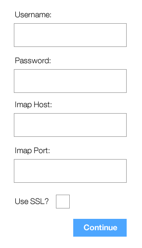
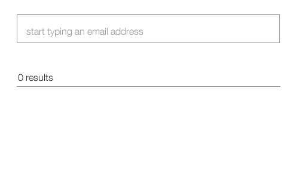
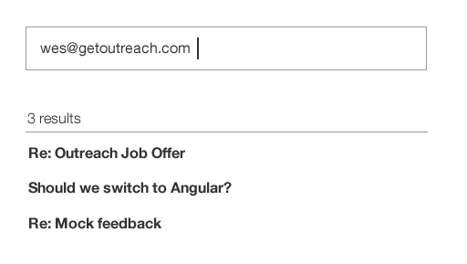

# Outreach Coding Challenge

Do you like whiteboard programming challenges and brain teasers? We do sometimes, but we also don't think they are the right tool to evaluate programming aptitude. The purpose of this challenge is to provide an opportunity to demonstrate real world programming ability. If you are not familiar with [React](https://facebook.github.io/react/), this challenge will also demonstrate the ability to rapidly pick up new technologies.

## The Challenge

The challenge is to create an extremely simple full-stack application using React and the backend of your choice. The application will allow users to input their [IMAP credentials](https://support.google.com/mail/troubleshooter/1668960?hl=en) and then retrieve all correspondences they have had with a particular email address.

The application should consist of at least two pages:

A page to input their IMAP credentials. This might look something like:

A page to allow the user to search for all emails from a particular email address:

The results should simply consist of email subjects:

The above is just a guideline. At the end of the day, anything that demonstrates a basic IMAP integration into a super simple React app will suffice.

## Submitting Your Challenge

To submit your completed challenge, *do not* create a pull request to his repo. Instead email a link to your fork.

## Bonus Points

Bonus points if you use/include any of the following:

* [Use ES2015](https://babeljs.io/)
* [React Router](https://github.com/ReactTraining/react-router)
* Use Ruby on the backend
* Include tests
* Make it pretty
